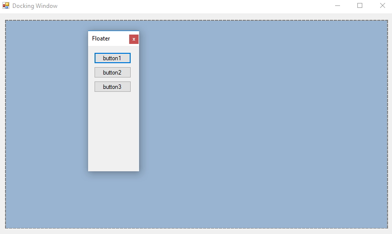

# WinForms Docking Windows

This repository contains implementation of docking a Form inside of the other Form. Undock form by double clicking its toolbar.

[WinForms Examples](https://github.com/NikolaGrujic91/WinForms-Examples)

